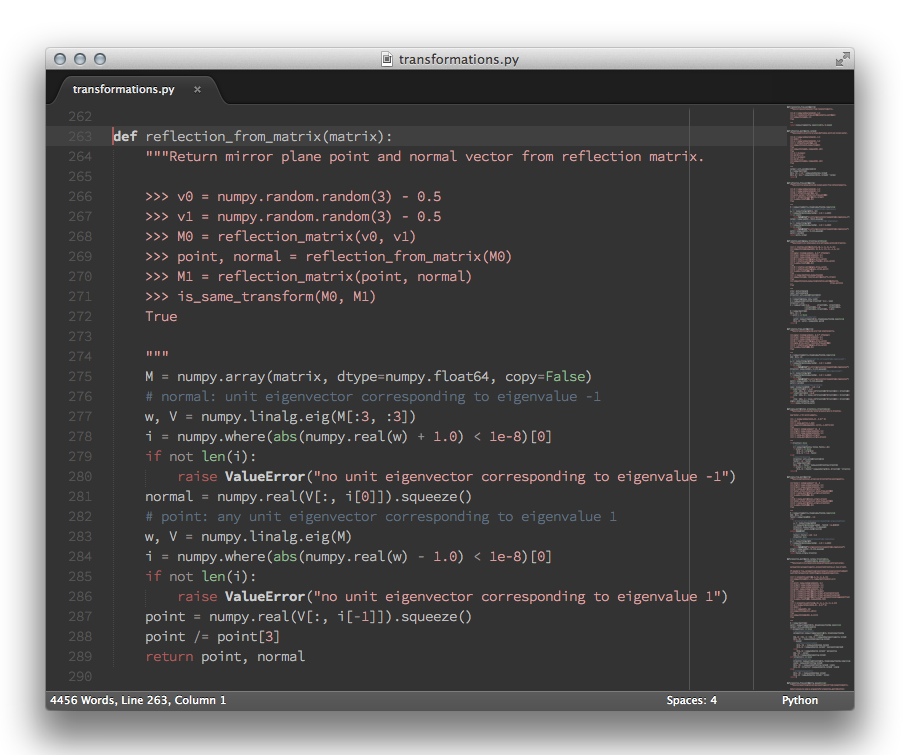

This work is licensed under a [Creative Commons Attribution 4.0 International License]
(https://creativecommons.org/licenses/by/4.0/).

## Desert Night Color Scheme

Dark Sublime Text color scheme inspired by Hans Fugal's [desert.vim]
(http://www.vim.org/scripts/script.php?script_id=105).

**Note:** Code snippet from Christoph Gohlke's [transformations.py]
(http://www.lfd.uci.edu/~gohlke/code/transformations.py.html).

### Installation

Download _Desert Night Color Scheme_ from [Package Control]
(http://wbond.net/sublime_packages/package_control)
(or copy _desert_night.tmTheme_ to a folder inside the _Packages/_ directory)
and activate it from the _Preferences/Color Scheme_ menu.

### Feedback

If you find any bugs or have suggestions for improvement, feel free to create
an issue or send me a pull request!
