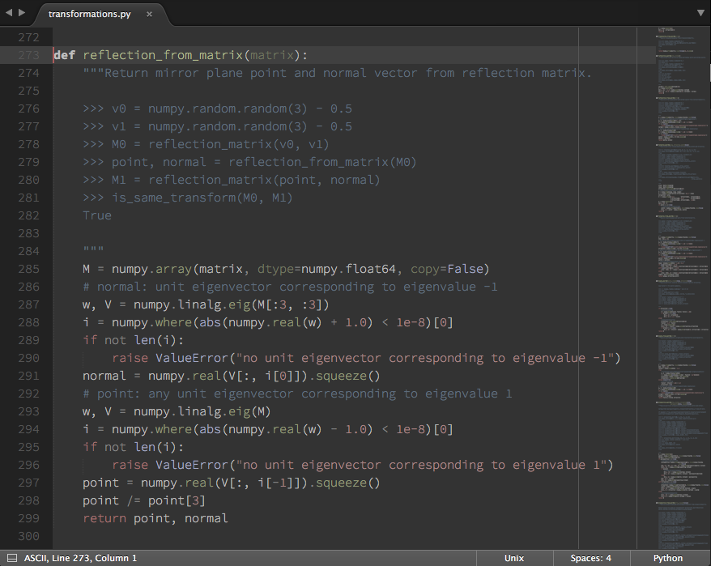

This work is licensed under a [Creative Commons Attribution 3.0
Unported License](http://creativecommons.org/licenses/by/3.0/).

Desert Night Color Scheme
-------------------------

Dark Sublime Text color scheme inspired by Hans Fugal's [Desert color scheme
for Vim](http://www.vim.org/scripts/script.php?script_id=105).

### Installation

_[Package Control](http://wbond.net/sublime_packages/package_control)_:
Search for "Desert Night Color Scheme".

_Manual_: Copy __desert_night.tmTheme__ into a folder inside the
__Packages/__ directory of Sublime Text and choose the color scheme using the
__Preferences/Color Scheme__ menu.

### Feedback

If you find any bugs or have suggestions for improvement, feel free to create
an issue or send me a pull request!
